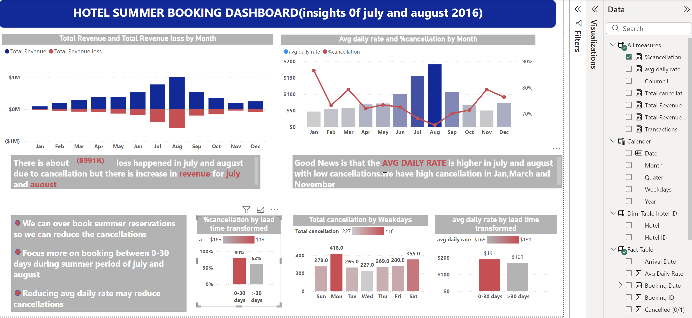

# Hotel Summer Booking Dashboard

## 🏨 Overview
This repository contains a Power BI dashboard providing insights into hotel bookings for the summer months of **July and August 2016**. The dashboard visualizes key metrics such as revenue, cancellations, average daily rates, and cancellation trends, offering actionable insights to optimize summer reservation strategies.

---

## 📊 Features

### 1. **Total Revenue vs Total Revenue Loss by Month**
   - Compares **total revenue** to **revenue loss** due to cancellations.
   - Highlights a significant **loss of approximately $991K** in July and August.

### 2. **Average Daily Rate and % Cancellations by Month**
   - Visualizes the **average daily rate** alongside the **percentage of cancellations**.
   - Shows high daily rates in July and August, despite substantial cancellations.

### 3. **% Cancellations by Lead Time**
   - Examines cancellations based on booking lead times:  
     - **0–30 days** (higher cancellations).  
     - **>30 days** (lower cancellations).

### 4. **Total Cancellations by Weekday**
   - Highlights weekdays with the most cancellations:
     - **Monday** sees the highest cancellations, followed by **Saturday**.

### 5. **Average Daily Rate by Lead Time**
   - Compares average daily rates for bookings made:
     - **0–30 days** in advance (higher daily rate).  
     - **>30 days** in advance (lower daily rate).

---

## 🔑 Key Insights
- **Revenue Loss**: A total of **$991K** in losses occurred in July and August due to cancellations.
- **Revenue Opportunity**: Despite cancellations, **July saw increased revenue**.
- **Seasonal Trends**:  
  - **Higher daily rates** were observed in July and August.  
  - **Low cancellation rates** occurred in **November**.
- **Lead Time Patterns**: Bookings made closer to the check-in date (0–30 days) have higher cancellation rates.

---

## ✅ Recommendations
1. **Overbooking Strategy**:  
   Overbook during summer months to offset cancellation losses.

2. **Focus on Last-Minute Bookings**:  
   Target customers booking within **0–30 days** with promotions or discounts.

3. **Dynamic Pricing**:  
   Experiment with lowering the average daily rate to reduce cancellations.

4. **Monitor Weekday Trends**:  
   Adjust marketing and cancellation policies for **peak cancellation days** like Mondays and Saturdays.

---

## 🛠️ How to Use
1. **Explore the Dashboard**:  
   Open the Power BI file to interact with detailed visuals and insights.
   
2. **Filter and Analyze**:  
   Use filters for **lead time**, **months**, and **other dimensions** to customize the analysis.

3. **Make Data-Driven Decisions**:  
   Leverage insights to optimize reservation strategies and increase revenue.

---

## 📈 Visualizations
- **Bar Charts**: Total Revenue and Revenue Loss by Month.
- **Combination Charts**: Average Daily Rate and % Cancellations by Month.
- **Lead Time Analysis**: % Cancellations and Average Daily Rate by Lead Time.
- **Weekday Trends**: Total Cancellations by Weekday.

---

## ✨ Dashboard Preview

---

Feel free to contribute or provide feedback to improve the analysis! 🚀
